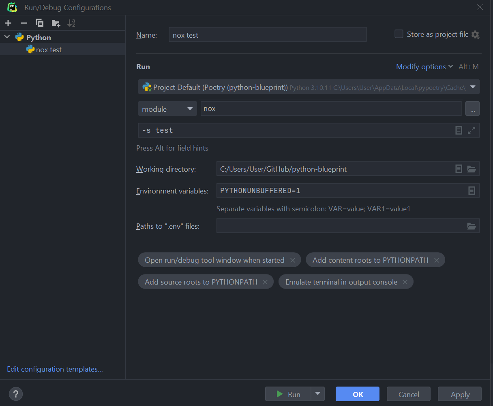

# python-blueprint

[![GitHub Actions][github-actions-badge]](https://github.com/johnthagen/python-blueprint/actions)
[![Poetry][poetry-badge]](https://python-poetry.org/)
[![Nox][nox-badge]](https://github.com/wntrblm/nox)
[![Ruff][ruff-badge]](https://github.com/astral-sh/ruff)
[![Type checked with mypy][mypy-badge]](https://mypy-lang.org/)

[github-actions-badge]: https://github.com/johnthagen/python-blueprint/workflows/python/badge.svg
[poetry-badge]: https://img.shields.io/endpoint?url=https://python-poetry.org/badge/v0.json
[nox-badge]: https://img.shields.io/badge/%F0%9F%A6%8A-Nox-D85E00.svg
[ruff-badge]: https://img.shields.io/endpoint?url=https://raw.githubusercontent.com/astral-sh/ruff/main/assets/badge/v2.json
[mypy-badge]: https://www.mypy-lang.org/static/mypy_badge.svg

Example Python project that demonstrates how to create a Python package using the latest
Python testing, linting, and type checking tooling. The project contains a `fact` package that
provides a simple implementation of the
[factorial algorithm](https://en.wikipedia.org/wiki/Factorial) (`fact.lib`) and a command line
interface (`fact.cli`).

# Requirements

Python 3.8+.

# Package Management

This package uses [Poetry](https://python-poetry.org/) to manage dependencies and
isolated [Python virtual environments](https://docs.python.org/3/library/venv.html).

To proceed,
[install Poetry globally](https://python-poetry.org/docs/#installation)
onto your system.

## Dependencies

Dependencies are defined in [`pyproject.toml`](./pyproject.toml) and specific versions are locked
into [`poetry.lock`](./poetry.lock). This allows for exact reproducible environments across
all machines that use the project, both during development and in production.

To install all dependencies into an isolated virtual environment:

> Append `--sync` to uninstall dependencies that are no longer in use from the virtual environment.

```bash
$ poetry install
```

To [activate](https://python-poetry.org/docs/basic-usage#activating-the-virtual-environment) the
virtual environment that is automatically created by Poetry:

```bash
$ poetry shell
```

To deactivate the environment:

```bash
(fact) $ exit
```

To upgrade all dependencies to their latest versions:

```bash
$ poetry update
```

## Packaging

This project is designed as a Python package, meaning that it can be bundled up and redistributed
as a single compressed file.

Packaging is configured by:

- [`pyproject.toml`](./pyproject.toml)

To package the project as both a 
[source distribution](https://packaging.python.org/en/latest/flow/#the-source-distribution-sdist)
and a [wheel](https://packaging.python.org/en/latest/specifications/binary-distribution-format/):

```bash
$ poetry build
```

This will generate `dist/fact-1.0.0.tar.gz` and `dist/fact-1.0.0-py3-none-any.whl`.

Read more about the [advantages of wheels](https://pythonwheels.com/) to understand why generating
wheel distributions are important.

## Publish Distributions to PyPI

Source and wheel redistributable packages can
be [published to PyPI](https://python-poetry.org/docs/cli#publish) or installed
directly from the filesystem using `pip`.

```bash
$ poetry publish
```

> Note: To enable publishing, remove the `"Private :: Do Not Upload"`
> [trove classifier](https://pypi.org/classifiers/).

# Enforcing Code Quality

Automated code quality checks are performed using 
[Nox](https://nox.thea.codes/en/stable/) and
[`nox-poetry`](https://nox-poetry.readthedocs.io/en/stable/). Nox will automatically create virtual
environments and run commands based on [`noxfile.py`](./noxfile.py) for unit testing, PEP 8 style
guide checking, type checking and documentation generation.

> Note: `nox` is installed into the virtual environment automatically by the `poetry install`
> command above. Run `poetry shell` to activate the virtual environment.

To run all default sessions:

```bash
(fact) $ nox
```

## Unit Testing

Unit testing is performed with [pytest](https://pytest.org/). pytest has become the de facto Python
unit testing framework. Some key advantages over the built-in
[unittest](https://docs.python.org/3/library/unittest.html) module are:

1. Significantly less boilerplate needed for tests.
2. PEP 8 compliant names (e.g. `pytest.raises()` instead of `self.assertRaises()`).
3. Vibrant ecosystem of plugins.

pytest will automatically discover and run tests by recursively searching for folders and `.py`
files prefixed with `test` for any functions prefixed by `test`.

The `tests` folder is created as a Python package (i.e. there is an `__init__.py` file within it)
because this helps `pytest` uniquely namespace the test files. Without this, two test files cannot
be named the same, even if they are in different subdirectories.

Code coverage is provided by the [pytest-cov](https://pytest-cov.readthedocs.io/en/latest/) plugin.

When running a unit test Nox session (e.g. `nox -s test`), an HTML report is generated in
the `htmlcov` folder showing each source file and which lines were executed during unit testing.
Open `htmlcov/index.html` in a web browser to view the report. Code coverage reports help identify
areas of the project that are currently not tested.

pytest and code coverage are configured in [`pyproject.toml`](./pyproject.toml).

To pass arguments to `pytest` through `nox`:

```bash
(fact) $ nox -s test -- -k invalid_factorial
```

## Code Style Checking

[PEP 8](https://peps.python.org/pep-0008/) is the universally accepted style guide for Python
code. PEP 8 code compliance is verified using [Ruff][Ruff]. Ruff is configured in the
`[tool.ruff]` section of [`pyproject.toml`](./pyproject.toml).

[Ruff]: https://github.com/astral-sh/ruff

Some code style settings are included in [`.editorconfig`](./.editorconfig) and will be configured
automatically in editors such as PyCharm.

To lint code, run:

```bash
(fact) $ nox -s lint
```

To automatically fix fixable lint errors, run:

```bash
(fact) $ nox -s lint_fix
```

## Automated Code Formatting

[Ruff][Ruff] is used to automatically format code and group and sort imports.

To automatically format code, run:

```bash
(fact) $ nox -s fmt
```

## Type Checking

[Type annotations](https://docs.python.org/3/library/typing.html) allows developers to include
optional static typing information to Python source code. This allows static analyzers such
as [mypy](http://mypy-lang.org/), [PyCharm](https://www.jetbrains.com/pycharm/),
or [Pyright](https://github.com/microsoft/pyright) to check that functions are used with the
correct types before runtime.

Editors such as [PyCharm](https://www.jetbrains.com/help/pycharm/type-hinting-in-product.html) and
VS Code are able to provide much richer auto-completion, refactoring, and type checking while the
user types, resulting in increased productivity and correctness.

```python
def factorial(n: int) -> int:
    ...
```

mypy is configured in [`pyproject.toml`](./pyproject.toml). To type check code, run:

```bash
(fact) $ nox -s type_check
```

See also [awesome-python-typing](https://github.com/typeddjango/awesome-python-typing).

### Distributing Type Annotations

[PEP 561](https://www.python.org/dev/peps/pep-0561/) defines how a Python package should
communicate the presence of inline type annotations to static type
checkers. [mypy's documentation](https://mypy.readthedocs.io/en/stable/installed_packages.html)
provides further examples on how to do this.

Mypy looks for the existence of a file named [`py.typed`](./src/fact/py.typed) in the root of the
installed package to indicate that inline type annotations should be checked.

## Continuous Integration

Continuous integration is provided by [GitHub Actions](https://github.com/features/actions). This
runs all tests, lints, and type checking for every commit and pull request to the repository.

GitHub Actions is configured in [`.github/workflows/python.yml`](./.github/workflows/python.yml).

# Documentation

## Generating a User Guide

[Material for MkDocs](https://squidfunk.github.io/mkdocs-material/) is a powerful static site
generator that combines easy-to-write Markdown, with a number of Markdown extensions that increase
the power of Markdown. This makes it a great fit for user guides and other technical documentation.

The example MkDocs project included in this project is configured to allow the built documentation
to be hosted at any URL or viewed offline from the file system.

To build the user guide, run,

```bash
(fact) $ nox -s docs
```

and open `docs/user_guide/site/index.html` using a web browser.

To build the user guide, additionally validating external URLs, run:

```bash
(fact) $ nox -s docs_check_urls
```

To build the user guide in a format suitable for viewing directly from the file system, run:

```bash
(fact) $ nox -s docs_offline
```

To build and serve the user guide with automatic rebuilding as you change the contents,
run:

```bash
(fact) $ nox -s docs_serve
``` 

and open <http://127.0.0.1:8000> in a browser.

Each time the `main` Git branch is updated, the 
[`.github/workflows/pages.yml`](.github/workflows/pages.yml) GitHub Action will
automatically build the user guide and publish it to [GitHub Pages](https://pages.github.com/).
This is configured in the `docs_github_pages` Nox session. This hosted user guide
can be viewed at <https://johnthagen.github.io/python-blueprint/>.

## Generating API Documentation

This project uses [mkdocstrings](https://github.com/mkdocstrings/mkdocstrings) plugin for
MkDocs, which renders
[Google-style docstrings](https://www.sphinx-doc.org/en/master/usage/extensions/napoleon.html)
into an MkDocs project. Google-style docstrings provide a good mix of easy-to-read docstrings in
code as well as nicely-rendered output.

```python
"""Computes the factorial through a recursive algorithm.

Args:
    n: A positive input value.

Raises:
    InvalidFactorialError: If n is less than 0.

Returns:
    Computed factorial.
"""
```

# Project Structure

Traditionally, Python projects place the source for their packages in the root of the project
structure, like:

``` {.sourceCode .}
fact
├── fact
│   ├── __init__.py
│   ├── cli.py
│   └── lib.py
├── tests
│   ├── __init__.py
│   └── test_fact.py
├── noxfile.py
└── pyproject.toml
```

However, this structure
is [known](https://docs.pytest.org/en/latest/goodpractices.html#tests-outside-application-code) to
have bad interactions with `pytest` and `nox`, two standard tools maintaining Python projects. The
fundamental issue is that Nox creates an isolated virtual environment for testing. By installing
the distribution into the virtual environment, `nox` ensures that the tests pass even after the
distribution has been packaged and installed, thereby catching any errors in packaging and
installation scripts, which are common. Having the Python packages in the project root subverts
this isolation for two reasons:

1. Calling `python` in the project root (for example, `python -m pytest tests/`) 
   [causes Python to add the current working directory](https://docs.pytest.org/en/latest/pythonpath.html#invoking-pytest-versus-python-m-pytest)
   (the project root) to `sys.path`, which Python uses to find modules. Because the source
   package `fact` is in the project root, it shadows the `fact` package installed in the Nox
   session.
2. Calling `pytest` directly anywhere that it can find the tests will also add the project root
   to `sys.path` if the `tests` folder is a Python package (that is, it contains a `__init__.py`
   file).
   [pytest adds all folders containing packages](https://docs.pytest.org/en/latest/goodpractices.html#conventions-for-python-test-discovery)
   to `sys.path` because it imports the tests like regular Python modules.

In order to properly test the project, the source packages must not be on the Python path. To
prevent this, there are three possible solutions:

1. Remove the `__init__.py` file from `tests` and run `pytest` directly as a Nox session.
2. Remove the `__init__.py` file from tests and change the working directory of `python -m pytest`
   to `tests`.
3. Move the source packages to a dedicated `src` folder.

The dedicated `src` directory is the 
[recommended solution](https://docs.pytest.org/en/latest/pythonpath.html#test-modules-conftest-py-files-inside-packages)
by `pytest` when using Nox and the solution this blueprint promotes because it is the least brittle
even though it deviates from the traditional Python project structure. It results is a directory
structure like:

``` {.sourceCode .}
fact
├── src
│   └── fact
│       ├── __init__.py
│       ├── cli.py
│       └── lib.py
├── tests
│   ├── __init__.py
│   └── test_fact.py
├── noxfile.py
└── pyproject.toml
```

# Licensing

Licensing for the project is defined in:

- [`LICENSE.txt`](./LICENSE.txt)
- [`pyproject.toml`](./pyproject.toml)

This project uses a common permissive license, the MIT license.

You may also want to list the licenses of all the packages that your Python project depends on.
To automatically list the licenses for all dependencies in (and their transitive dependencies)
using [pip-licenses](https://github.com/raimon49/pip-licenses):

```bash
(fact) $ nox -s licenses
...
 Name      Version  License     
 click     8.1.3    BSD License 
 colorama  0.4.4    BSD License 
 typer     0.4.1    MIT License 
```

# Container

[Docker](https://www.docker.com/) is a tool that allows for software to be packaged into isolated
containers. It is not necessary to use Docker in a Python project, but for the purposes of
presenting best practice examples, a Docker configuration is provided in this project. The Docker
configuration in this repository is optimized for small size and increased security, rather than
simplicity.

Docker is configured in:

- [`Dockerfile`](./Dockerfile)
- [`.dockerignore`](./.dockerignore)

To build the container image:

```bash
$ docker build --tag fact .
```

To run the image in a container:

```bash
$ docker run --rm --interactive --tty fact 5
```

> Note: If you need to install Poetry on Alpine Linux, see the pre-built 
> [`poetry` package](https://pkgs.alpinelinux.org/packages?name=poetry&branch=edge) for that
> platform rather than running `pip install poetry`. This avoids needing to build Poetry
> dependencies from source.
> 
> ```Dockerfile
> FROM alpine:latest
>
> RUN apk add --no-cache poetry
> ```

# Miscellaneous

## Shebang Line

The proper [shebang](https://en.wikipedia.org/wiki/Shebang_(Unix)) line for Python scripts is:

```py
#!/usr/bin/env python3
```

## Installing Newer Python on Ubuntu

Ubuntu releases come with a default `python3` executable. This is frozen for the life of the OS
and only receives security and bug fixes. To install a newer version of Python globally,
consider the [deadsnakes PPA](https://launchpad.net/~deadsnakes/+archive/ubuntu/ppa).

```shell
sudo add-apt-repository ppa:deadsnakes
sudo apt update
sudo apt install python3.12
```

## Package Dependency Tree

[`poetry show`](https://python-poetry.org/docs/cli#show) is a Poetry command for listing installed
packages. The `--tree` option displays them in the form of a dependency tree. For large projects,
it is often difficult to determine dependency relationships soley from manually inspecting
`poetry.lock`.

```shell
$ poetry show --tree --only main

rich 12.6.0 Render rich text, tables, progress bars, syntax highlighting, markdown and more to the terminal
├── commonmark >=0.9.0,<0.10.0
├── pygments >=2.6.0,<3.0.0
└── typing-extensions >=4.0.0,<5.0
typer 0.7.0 Typer, build great CLIs. Easy to code. Based on Python type hints.
├── click >=7.1.1,<9.0.0
│   └── colorama * 
├── colorama >=0.4.3,<0.5.0
├── rich >=10.11.0,<13.0.0
│   ├── commonmark >=0.9.0,<0.10.0 
│   ├── pygments >=2.6.0,<3.0.0 
│   └── typing-extensions >=4.0.0,<5.0 
└── shellingham >=1.3.0,<2.0.0
```

# PyCharm Configuration

> Looking for a vivid dark color scheme for PyCharm?
> Try [One Dark theme](https://plugins.jetbrains.com/plugin/11938-one-dark-theme).

To configure [PyCharm](https://www.jetbrains.com/pycharm/) to align to the code style used in this
project:

- Settings | Search "Hard wrap at" (Note, this will be automatically set by
  [`.editorconfig`](./.editorconfig))
  - Editor | Code Style | General | Hard wrap at: 99

- Settings | Search "Optimize Imports"
  - Editor | Code Style | Python | Imports
      - ☑ Sort import statements
        - ☑ Sort imported names in "from" imports
        - ☐ Sort plain and "from" imports separately within a group
        - ☐ Sort case-insensitively
      - Structure of "from" imports
        - ◎ Leave as is
        - ◉ Join imports with the same source
        - ◎ Always split imports

- Settings | Search "Docstrings"
  - Tools | Python Integrated Tools | Docstrings | Docstring Format: Google

- Settings | Search "pytest"
  - Tools | Python Integrated Tools | Testing | Default test runner: pytest

- Settings | Search "Force parentheses"
  - Editor | Code Style | Python | Wrapping and Braces | "From" Import Statements
    - ☑ Force parentheses if multiline

## Ruff Integration

Integrate [Ruff](https://docs.astral.sh/ruff/integrations/#pycharm-external-tool) linting and 
formatting into PyCharm.

### Linting and Formatting

1. Install the [Ruff PyCharm Plugin](https://plugins.jetbrains.com/plugin/20574-ruff)
2. Open Preferences or Settings | Tools | Ruff
    - **Check**: Run Ruff when the python file is saved
    - **Check**: Use ruff format

Now, on <kbd>ctrl+s</kbd>, the current source file will be automatically formatted on save.

### Import Sorting

1. Ensure that the [File Watchers Plugin](https://plugins.jetbrains.com/plugin/7177-file-watchers)
   is installed.
2. Open Preferences or Settings | Tools | File Watchers and select `+` | `<custom>`
   
 

3. Fill in the following fields
    - **Name**: `ruff check --select I --fix`
    - **File Type**: Python
    - **Scope**: Project Files
    - **Program**: `$PyInterpreterDirectory$/python`
    - **Arguments**: `-m ruff check --select I --fix $FilePath$`
    - **Output paths to refresh**: `$FilePath$`
    - **Working directory**: `$ProjectFileDir$`
    - **Advanced Options**
      - **Uncheck**: Auto-save edited files to trigger the watcher
      - **Uncheck**: Trigger the watcher on external changes

  

> **Tip**
>
> These tools work best if you properly mark directories as excluded from the project that should 
> be, such as `.nox`. See 
> <https://www.jetbrains.com/help/pycharm/project-tool-window.html#content_pane_context_menu> on 
> how to Right-Click | Mark Directory as | Excluded.

## Nox Support

[PyCharm does not yet natively support Nox](https://youtrack.jetbrains.com/issue/PY-37302). The
recommended way to launch Nox from PyCharm is to create a **Python** 
[Run Configuration](https://www.jetbrains.com/help/pycharm/run-debug-configuration.html).

- Beside **Script Path**, press `▼` and select **Module name**: `nox`
- **Parameters**, enter a Nox session: `-s test`
- **Working Directory**: Enter the path to the current project
- Select **Modify Options** | Check **Emulate terminal in output console** to enable colors to be
  rendered properly


